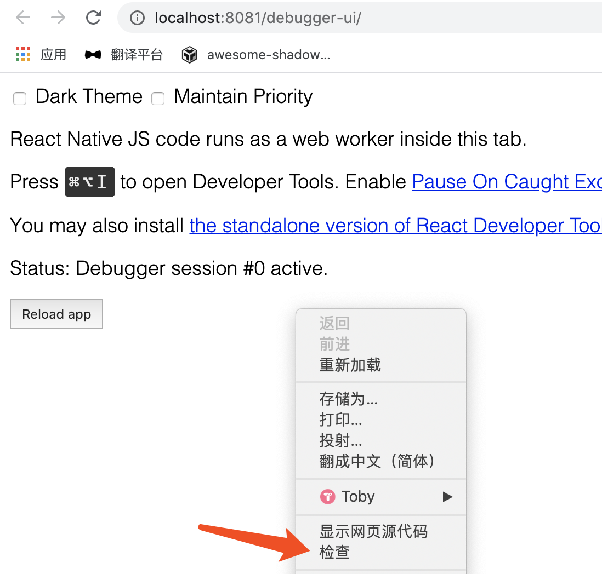
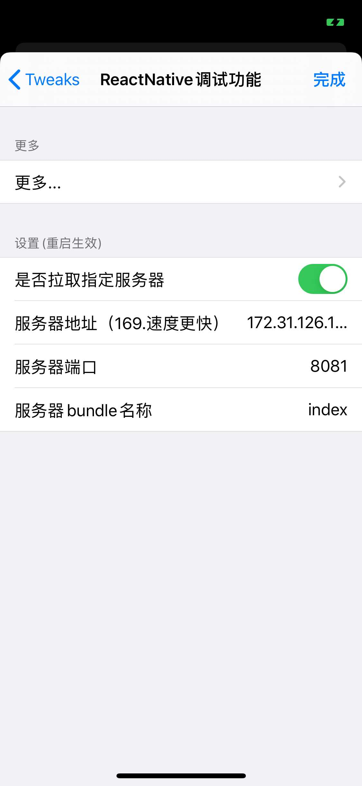
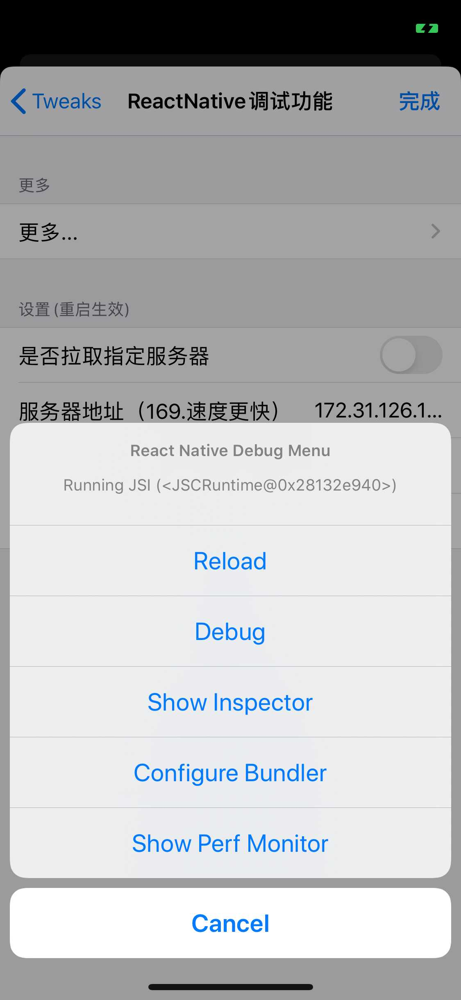

## 基本介绍

KwaiRN 是基于 reactjs 跨平台高性能 UI 框架

+ [在线 HelloWorld（CodeSandBox）](https://codesandbox.io/s/awesome-shadow-upt2g?file=/src/App.js)
	
+ [在线 HelloWorld（Snack）](https://snack.expo.io/)

+ [3 分钟入门 Reactjs](https://reactnative.dev/docs/intro-react)

+ [其它入门学习](https://reactnative.cn/docs/intro-react-native-components)

## 环境配置
#### IDE + 常用插件

[VSCode](https://code.visualstudio.com/)

常用插件

+ React Native Tools：集成 react-native 命令方便运行调试
+ React Native：Full Pack。开发全家桶，提高开发效率
		
#### 安装环境 / 配置 (macOS)

前端项目开发可以用 expo 或 npx

1. expo
	
	+ 适用场景：快速运行 Demo
	+ 优点：易用，扫码即运行
	+ 缺点：功能少，例如无法安装三方库
	+ 安装方法：
		1. npm install expo-cli --global
		2. 手机安装 [Expo Client](https://expo.io/tools##client)

2. npx

	+ 适用场景：深度开发
	+ 优点：功能强大
	+ 缺点：需要用有线方式连接手机
	+ 安装方法：`brew install node && brew install watchman`

[更多资料请点我](https://reactnative.dev/docs/environment-setup)

#### JS 工程的配置注意事项
JS 工程执行 `npm i` 进行安装依赖的时候，如果依赖了公司内部的私有源（比如 @ks/weblogger），那么 `npm i` 时会提示以下信息，此时我们需要切换源

```sh
npm ERR! code E404
npm ERR! 404 Not Found - GET https://registry.npmjs.org/@ks%2fweblogger - Not found
npm ERR! 404
npm ERR! 404  '@ks/weblogger@^3.5.6' is not in the npm registry.
npm ERR! 404 You should bug the author to publish it (or use the name yourself!)
npm ERR! 404 It was specified as a dependency of 'rn-popular'
npm ERR! 404
npm ERR! 404 Note that you can also install from a
npm ERR! 404 tarball, folder, http url, or git url.
npm ERR! A complete log of this run can be found in:
npm ERR!     /Users/nx/.npm/_logs/2020-06-12T06_14_36_279Z-debug.log
```

此时可以使用 nrm 工具来管理 npm 的源，具体操作如下

```sh
## 全局安装
npm i -g nrm
## 添加快手源
nrm add ks https://npm.corp.kuaishou.com
## 列出源
nrm ls
## 切换官方源
nrm use npm
## 切换快手源
nrm use ks
```

切换为快手源之后，再执行 `npm i` 就可以了


## 快速运行
### 1. 创建 JS 工程

```sh
npx react-native init MyReactNativeApp --version 0.62.2
cd MyReactNativeApp
```

### 2. 启动 JS 工程

```sh
npx react-native start
```

### 3. 安装快影调试包

+ Android


+ iOS


### 4. 在快影里面调试 RN

#### Android（任选一种）

+ 【设置】-【我的】-【KRN 配置】 输入 JS 包名回车保存，输入 Host 地址回车拉起 RN 页面（注意这里会修改所有 RN 入口的加载）
+ 在 RN 页面摇一摇出现菜单，修改 change bundle location，再重新进入 RN 页面
+ 连接 usb 线，在 PC 终端运行 adb reverse tcp:8081 tcp:8081，进入 RN 页面

PC 的命令行输入 'd'，终端会弹出调试面板


终端点击 "Debug"，PC Chrome 会弹出调试页


在调试页中右键，点击 "检查" 或 "Inspect"，即弹出调试工具 devtools。调试方式与网页调试一致。



#### iOS

1. iOS 在 Beta/Debug 版本可以通过摇一摇进入 RN 相关的调试页面，如下图



2. 首先要确认【是否拉取指定服务器】开关，如果关闭则读取的是本地内置的 JSBundle；如果打开则可以与电脑进行联调（电脑需要开启服务器)，一般输入 IP 地址即可，其他配置保持默认

3. 点击【更多】->【Debug】，就可以在 Chrome 上看到调试页面。注意这些配置需要重启生效，同时会持久化到本地，不需要每次都设置。




[更多调试资料请点我](https://reactnative.dev/docs/debugging)

> Devtools 调试是用 Chrome V8 执行的 JS 逻辑，与真机 JavaScriptCore 有区别。调试后需要在真机上运行验证